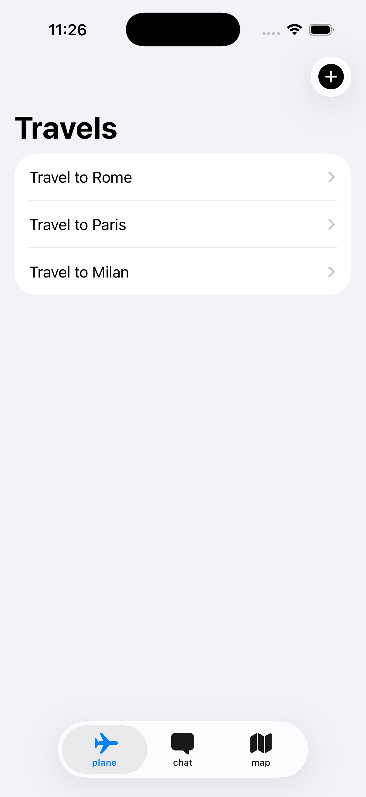
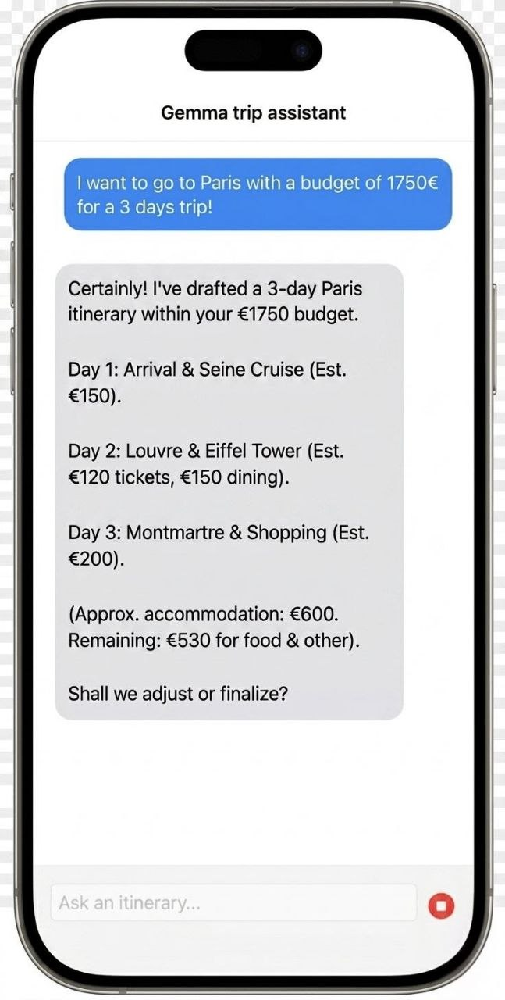
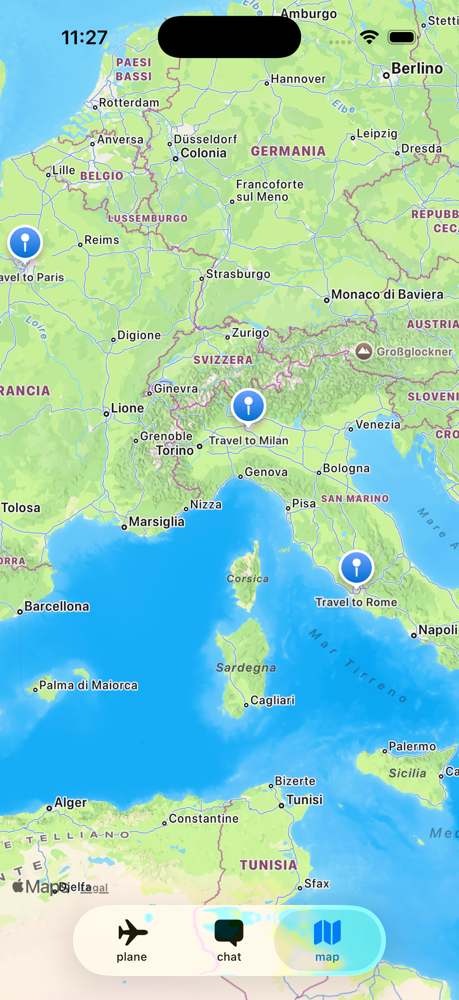

# TravelNoteApp

**Dein smarter Reiseplaner mit lokaler KI-Power – Träume kalkulieren, Roasts riskieren.**

TravelNoteApp ist der ultimative Begleiter für Weltenbummler, die das Beste aus ihrem Reisebudget herausholen wollen. Anstatt stundenlang Preise zu vergleichen und Routen manuell zu planen, tippst du einfach deine Budgetvorstellung und dein Wunschziel ein. Unsere integrierte, komplett lokal laufende KI analysiert deine Pläne in Sekundenschnelle.

Für wen ist sie geeignet? Für Individualreisende, Backpacker und Urlauber, die eine ehrliche, datengestützte Einschätzung ihrer Reisepläne suchen. Das Besondere: Reicht dein Budget nicht aus, nimmt die App kein Blatt vor den Mund und serviert dir einen humorvollen Realitätscheck. Ist dein Plan machbar, verwandelt sie ihn direkt in eine interaktive Reisekarte und strukturierte Notizen. Komplett offline-first und ohne teure Cloud-Gebühren.

## Design
Hier siehst du die Benutzeroberfläche der App im Einsatz.

  
  
  

## Features
Die TravelNoteApp kombiniert Notizmanagement mit KI-gestützter Finanzanalyse:

- [x] **Lokaler KI-Reiseassistent:** Vollwertiger Chatbot (Gemma) direkt auf dem Gerät, der Reisepläne schmiedet.
- [x] **Budget-Feasibility-Check:** Automatische Währungsumrechnung und Abgleich mit Echtzeit-Lebenshaltungskosten des Ziellandes.
- [x] **Smarter Itinerary-Export:** Generierte Reisepläne und Tagesaktivitäten lassen sich mit einem Klick als Notiz speichern.
- [x] **Interaktive Reisekarte:** Visuelle Darstellung all deiner geplanten Trips auf einer Map via MapKit inklusive Detail-Sheets.
- [x] **Offline-First Datenverwaltung:** Erstellung, Anzeige und Löschen von Reise-Erinnerungen und Routen.

## Technischer Aufbau

#### Projektaufbau
Das Projekt folgt einer klaren, modernen Architektur, die auf Apples **MVVM (Model-View-ViewModel)**:

* **Views:** `NavigatorView` (zentrales Tab-System), `TravelNotesListView` (Übersicht der Reisen), `TravelMap` (Kartenansicht) und `AiChatView` (KI-Chat-Interface).
* **ViewModels:** `ChatViewModel` (steuert das Laden des LLMs und die Chat-Generierung) und `TravelNoteViewModel` (verwaltet den State der Reiseliste).
* **Services:** `ViewModelsService` kapselt die Geschäftslogik, darunter NLP (Natural Language Processing), API-Anfragen, Geocoding und das Parsen von JSON-Antworten aus dem KI-Modell.

#### Datenspeicherung
Für die Datenhaltung wird **SwiftData** verwendet. Gespeichert werden persistente `TravelNote` Objekte, die Details wie Titel, Stadt, Budget, Machbarkeit, Koordinaten (Breiten- und Längengrad) sowie den generierten Reiseplan-Text enthalten. 
* **Warum SwiftData?** Es ermöglicht einen performanten, modernen und *Offline-First*-Ansatz. Daten sind sofort ohne Internetverbindung verfügbar, laden verzögerungsfrei und belasten keine externen Server-Datenbanken.

#### API Calls
Die App nutzt externe Schnittstellen, um das System mit Echtzeitdaten für die KI-Inferenz zu füttern:
* **Frankfurter API (`api.frankfurter.dev`):** Ermittelt tagesaktuelle Wechselkurse zwischen der Heimatwährung des Nutzers und der Währung des Reiseziels.
* **WhereNext Cost of Living API (`getwherenext.com`):** Liefert verlässliche Referenzdaten zu den durchschnittlichen Lebenshaltungskosten im Zielland.
* **Apple MKLocalSearch:** Extrahiert Geodaten, Länder- und Währungscodes basierend auf dem im Chat genannten Stadtnamen.

#### 3rd-Party Frameworks
* **MLX Swift (Apple ML Explore):** `MLXLLM` und `MLXHuggingFace` zur hardwarebeschleunigten Ausführung des On-Device-Sprachmodells.
* **Hugging Face / Tokenizers:** Für das Laden, Verwalten und Tokenisieren des Open-Source-Modells **Gemma 4B** .

## Ausblick
Die TravelNoteApp steht auf einem starken Fundament. Für zukünftige Versionen sind folgende Erweiterungen geplant:

- [ ] **Erweitertes Ausgaben-Tracking:** Einpflegen von realen Ausgaben während der Reise innerhalb der Notiz, um das Budget live zu überwachen.
- [ ] **Lokale Benachrichtigungen:** Smarte Reminder für anstehende Reisedaten.
- [ ] **iCloude:** Sicheres Speichern und geräteübergreifendes Synchronisieren der Notizen.
